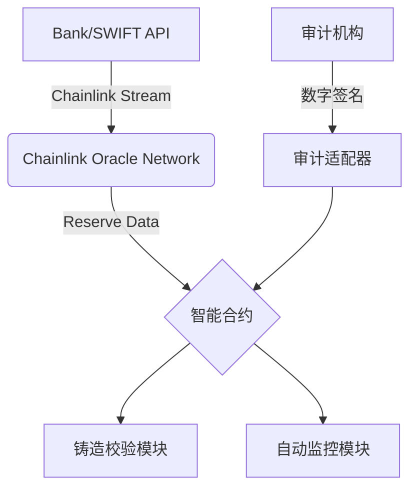

# 稳定币储备金链上实时审计与铸造控制系统

## 背景

传统金融机构需要发行稳定币来作为其web3业务的基础货币，其储备金的透明性和可信度一直是行业痛点。传统中心化稳定币（如USDT、USDC）依赖第三方审计机构定期披露储备金数据，但存在以下问题：

**储备金透明度不足：**用户无法实时验证稳定币发行方的储备金是否充足。

**铸造过程缺乏自动化验证：**铸造稳定币时缺乏实时储备金检查，可能导致超额发行。

**链下数据整合困难：**法币、链下资产等储备金数据难以直接上链验证。

**审计滞后性：**季报/年报模式无法满足实时验证需求，2022年Terra崩盘事件暴露了延时审计的致命缺陷

**单点信任风险：**审计机构可能被贿赂或操控，Bitfinex储备金争议事件证明中心化审计存在信任漏洞

**数据孤岛化：**银行、托管机构、区块链网络间的数据隔离导致跨系统验证困难

## 项目概述

结合了Chainlink去中心化预言机的技术能力和智能合约的自动化执行逻辑，为稳定币发行提供高透明度和实时审计的解决方案。

**核心功能：**

1. **铸造验证**：发行商发起稳定币铸造时，智能合约自动通过Chainlink Data Streams调用银行/SWIFT API 实时查询链下储备金余额，验证满足质押率后才能完成铸造，质押率 = 链下储备金余额 / (链上稳定币总量 + 待铸造数量)
2. **动态监控**：通过 Chainlink Automation 定时每15分钟调用银行/SWIFT API 查询链下储备金余额，与链上稳定币总量实时核对，一旦质押率不满足要求触发熔断机制
3. **熔断机制**：若储备金低于安全阈值（如105%抵押率）时自动调用稳定币合约紧急暂停接口，暂停稳定币铸造、转账等功能，防止进一步坏账的发生，质押率恢复至105%后方可人工重启铸造。
4. **审计机构协同治理**：开发标准化的审计机构多签专属钱包，允许多家第三方审计公司（如Mazars、四大会计师事务所）通过数字签名向智能合约提交“储备不足证明”数据证明，满足钱包多签阈值后执行合约级“强制冻结”指令
5. **可视化监控面板**：动态显示储备金构成与历史铸造记录，实时显示抵押率曲线

## 技术架构

| 层级           | 技术实现                                                     |
| -------------- | ------------------------------------------------------------ |
| **银行接口层** | SWIFT API + Open Banking Standard                            |
| **审计接入层** | Safe Smart Contract Wallet + Audit module                    |
| **预言机层**   | Chainlink Data Streams + Chainlink Automation                |
| **智能合约层** | Solidity 0.8.21+ OpenZeppelin 5.0 ERC20 + Chainlink Contract |

## 安全机制
- **去中心化验证**：3个以上独立Chainlink节点运营商交叉验证数据
- **数据加密**：TLS 1.3加密传输 + 链上签名验证

## 注意事项

部署前请确保已完成：

> 1. **银行接口可靠性：**需配置 SWIFT 备用通道和商业银行账户的API访问授权
> 2. **预言机去中心化**：建议至少接入 3 个独立数据源以防止单点故障
> 3. **超额抵押要求**：建议维持 105-110% 的储备率缓冲

## 未来发展

1. **多资产储备金**  
   支持不同法币或其他资产组合的储备金池管理

2. **DAO治理模块**  
   允许社区投票修改关键参数如质押率：

3.  **零知识证明模块**

   使用PLONK或ZK-SNARK算法生成储备金存在证明，保护商业隐私的同时保证可验证性

4. **多链部署**

   支持Solana、Aptos等链部署

5. **合规性设计** 
   支持监管机构接入，设置要求质押率等参数（如欧盟MiCA框架要求）

## 参考案例
Paxos黄金通证(PAXG)的储备审计系统

Chainlink储备金证明在WBTC的应用

MakerDAO的多预言机价格反馈机制

## 参考文档

[Chainlink储备金证明文档](https://docs.chain.link/proof-of-reserve)

[SWIFT API集成指南](https://www.swift.com/apis)

[OpenEden验证系统案例研究](https://docs.openeden.com/usdo/legal)

## 贡献指南

欢迎通过GitHub Issues提交改进建议，如支持更多银行API协议（如FEDWIRE、SEPA

核心功能开发请先阅读[技术规范文档](./SPEC.md)。

---

**许可证** MIT © 2025 Stablecoin Reserve System Developers  
*本系统不构成任何形式的金融建议，使用者需自行承担风险*

